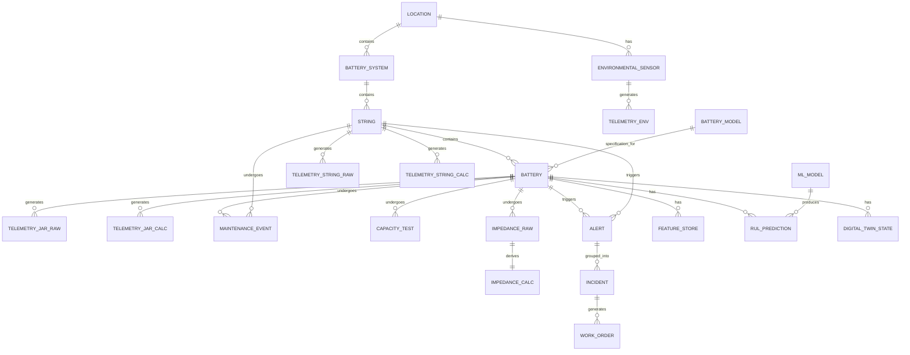
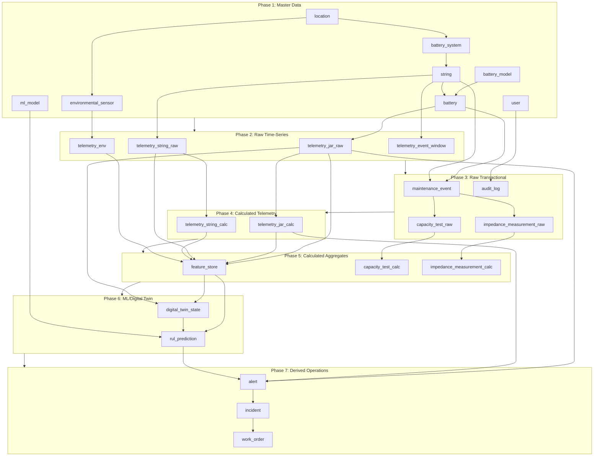

This document defines the complete relational data schema for the Battery RUL Prediction system, designed to support synthetic data generation for development, testing, and ML model training.

<aside>
📋

**Data Classification for Synthesis**

- **Raw Data** — Direct sensor readings and transactional records (synthesize first)
- **Calculated Data** — Derived/computed values from raw data (compute after synthesis)
- **Master Data** — Reference tables with static/slow-changing data
</aside>

---

# 1. Entity Relationship Diagram



---

# 2. Master Data Tables

<aside>
📁

**Master Data** — Reference tables with static or slow-changing configuration data. Generate once at the start of synthesis.

</aside>

### 2.1 `location`

Data center site information.

| Column | Type | Constraints | Description |
| --- | --- | --- | --- |
| `location_id` | UUID | PK | Unique identifier |
| `location_code` | VARCHAR(20) | UNIQUE, NOT NULL | Short code (e.g., `DC-BKK-01`) |
| `location_name` | VARCHAR(100) | NOT NULL | Full name (e.g., `Bangrak Data Center`) |
| `region` | ENUM | NOT NULL | `northern`, `northeastern`, `central`, `eastern`, `southern` |
| `city` | VARCHAR(50) | NOT NULL | City name |
| `latitude` | DECIMAL(10,7) |  | GPS latitude |
| `longitude` | DECIMAL(10,7) |  | GPS longitude |
| `timezone` | VARCHAR(50) | NOT NULL | IANA timezone (e.g., `Asia/Bangkok`) |
| `commissioned_date` | DATE |  | Site commissioning date |
| `is_active` | BOOLEAN | DEFAULT TRUE | Operational status |
| `created_at` | TIMESTAMP | NOT NULL | Record creation time |
| `updated_at` | TIMESTAMP | NOT NULL | Last update time |

**Sample values for `region`:** `northern` (Chiangmai), `northeastern` (Khon Kaen), `central` (Nonthaburi, Bangrak, Phrakhanong), `eastern` (Sriracha), `southern` (Surat Thani, Phuket, Hat Yai)

---

### 2.2 `battery_model`

Battery specification reference.

| Column | Type | Constraints | Description |
| --- | --- | --- | --- |
| `model_id` | UUID | PK | Unique identifier |
| `model_name` | VARCHAR(50) | UNIQUE, NOT NULL | Model name (e.g., `HX12-120`) |
| `manufacturer` | VARCHAR(100) |  | Manufacturer name |
| `chemistry` | ENUM | NOT NULL | `VRLA`, `Li-ion`, `NiMH` |
| `nominal_voltage_v` | DECIMAL(5,2) | NOT NULL | Nominal voltage (12.0 V) |
| `capacity_ah` | DECIMAL(6,2) | NOT NULL | Rated capacity (120 Ah) |
| `float_voltage_min_v` | DECIMAL(5,2) | NOT NULL | Float voltage lower bound (13.50 V) |
| `float_voltage_max_v` | DECIMAL(5,2) | NOT NULL | Float voltage upper bound (13.80 V) |
| `boost_voltage_min_v` | DECIMAL(5,2) |  | Boost/equalize lower bound (14.40 V) |
| `boost_voltage_max_v` | DECIMAL(5,2) |  | Boost/equalize upper bound (14.70 V) |
| `max_charge_current_a` | DECIMAL(6,2) |  | Max initial charge current (36 A) |
| `temp_warning_c` | DECIMAL(4,1) |  | Temperature warning threshold (45°C) |
| `temp_critical_c` | DECIMAL(4,1) |  | Temperature critical threshold (50°C) |
| `expected_life_years` | DECIMAL(4,1) |  | Expected service life |
| `datasheet_url` | VARCHAR(500) |  | Link to datasheet |

---

### 2.3 `battery_system`

UPS or Rectifier system grouping.

| Column | Type | Constraints | Description |
| --- | --- | --- | --- |
| `system_id` | UUID | PK | Unique identifier |
| `location_id` | UUID | FK → location | Parent location |
| `system_code` | VARCHAR(30) | UNIQUE, NOT NULL | Code (e.g., `DC-BKK-UPS-01`) |
| `system_type` | ENUM | NOT NULL | `UPS`, `RECTIFIER` |
| `system_name` | VARCHAR(100) |  | Descriptive name |
| `manufacturer` | VARCHAR(100) |  | UPS/Rectifier manufacturer |
| `model` | VARCHAR(100) |  | UPS/Rectifier model |
| `rated_power_kva` | DECIMAL(8,2) |  | Rated power capacity |
| `installed_date` | DATE |  | Installation date |
| `is_active` | BOOLEAN | DEFAULT TRUE | Operational status |
| `created_at` | TIMESTAMP | NOT NULL |  |
| `updated_at` | TIMESTAMP | NOT NULL |  |

---

### 2.4 `string`

Battery string (series-connected batteries).

| Column | Type | Constraints | Description |
| --- | --- | --- | --- |
| `string_id` | UUID | PK | Unique identifier |
| `system_id` | UUID | FK → battery_system | Parent system |
| `string_code` | VARCHAR(30) | UNIQUE, NOT NULL | Code (e.g., `DC-BKK-UPS-01-S1`) |
| `string_position` | INT | NOT NULL | Position index (1-6 for UPS, 1-3 for Rectifier) |
| `batteries_count` | INT | NOT NULL | Number of batteries in string (24) |
| `nominal_voltage_v` | DECIMAL(6,2) |  | String nominal voltage (288 V for 24×12V) |
| `installed_date` | DATE |  | Installation date |
| `last_capacity_test_date` | DATE |  | Last full capacity test |
| `is_active` | BOOLEAN | DEFAULT TRUE |  |
| `created_at` | TIMESTAMP | NOT NULL |  |
| `updated_at` | TIMESTAMP | NOT NULL |  |

---

### 2.5 `battery`

Individual battery jar.

| Column | Type | Constraints | Description |
| --- | --- | --- | --- |
| `battery_id` | UUID | PK | Unique identifier |
| `string_id` | UUID | FK → string | Parent string |
| `model_id` | UUID | FK → battery_model | Battery specification |
| `battery_code` | VARCHAR(40) | UNIQUE, NOT NULL | Code (e.g., `DC-BKK-UPS-01-S1-J12`) |
| `serial_number` | VARCHAR(50) |  | Manufacturer serial |
| `position_in_string` | INT | NOT NULL | Position (1-24) |
| `manufacture_date` | DATE |  | Manufacturing date |
| `installed_date` | DATE |  | Installation date |
| `warranty_expiry_date` | DATE |  | Warranty end date |
| `initial_capacity_ah` | DECIMAL(6,2) |  | Baseline capacity at install |
| `initial_resistance_mohm` | DECIMAL(8,3) |  | Baseline internal resistance |
| `status` | ENUM | NOT NULL | `active`, `warning`, `critical`, `replaced`, `retired` |
| `replacement_of` | UUID | FK → battery (self) | Previous battery if replaced |
| `replaced_date` | DATE |  | When replaced |
| `created_at` | TIMESTAMP | NOT NULL |  |
| `updated_at` | TIMESTAMP | NOT NULL |  |

---

### 2.6 `environmental_sensor`

Environmental sensor registry.

| Column | Type | Constraints | Description |
| --- | --- | --- | --- |
| `sensor_id` | UUID | PK | Unique identifier |
| `location_id` | UUID | FK → location | Parent location |
| `sensor_code` | VARCHAR(30) | UNIQUE | Sensor code |
| `sensor_type` | ENUM |  | `temperature`, `humidity`, `combined` |
| `zone` | VARCHAR(50) |  | Zone/room placement |
| `is_active` | BOOLEAN | DEFAULT TRUE |  |

---

### 2.7 `user`

System users.

| Column | Type | Constraints | Description |
| --- | --- | --- | --- |
| `user_id` | UUID | PK | Unique identifier |
| `email` | VARCHAR(255) | UNIQUE, NOT NULL | Email address |
| `name` | VARCHAR(100) | NOT NULL | Full name |
| `role` | ENUM | NOT NULL | `admin`, `engineer`, `operator`, `viewer` |
| `location_ids` | JSONB |  | Assigned locations (array) |
| `is_active` | BOOLEAN | DEFAULT TRUE |  |
| `created_at` | TIMESTAMPTZ | NOT NULL |  |
| `updated_at` | TIMESTAMPTZ | NOT NULL |  |

---

### 2.8 `ml_model`

Model registry.

| Column | Type | Constraints | Description |
| --- | --- | --- | --- |
| `model_id` | UUID | PK | Unique identifier |
| `model_name` | VARCHAR(100) | NOT NULL | Model name |
| `model_type` | ENUM | NOT NULL | `catboost_rul`, `anomaly_iforest`, `anomaly_ae`, `survival` |
| `version` | VARCHAR(20) | NOT NULL | Semantic version |
| `status` | ENUM | NOT NULL | `training`, `staging`, `production`, `retired` |
| `trained_at` | TIMESTAMPTZ |  | Training completion |
| `promoted_at` | TIMESTAMPTZ |  | Promotion to production |
| `retired_at` | TIMESTAMPTZ |  |  |
| `artifact_url` | VARCHAR(500) |  | Object store URL |
| `hyperparameters_json` | JSONB |  | Training hyperparameters |
| `metrics_json` | JSONB |  | Validation metrics (AUROC, precision, etc.) |
| `feature_list` | JSONB |  | Features used |
| `training_data_start` | TIMESTAMPTZ |  | Training data range start |
| `training_data_end` | TIMESTAMPTZ |  | Training data range end |
| `created_by` | UUID | FK → user |  |

---

# 3. Raw Data Tables (Time-Series)

<aside>
📡

**Raw Data** — Direct sensor readings from BMS/SCADA. Synthesize these first using physics-based models and noise profiles.

</aside>

### 3.1 `telemetry_jar_raw`

Per-battery **raw sensor readings** (high volume).

| Column | Type | Constraints | Description | Synthesis Method |
| --- | --- | --- | --- | --- |
| `ts` | TIMESTAMPTZ | PK (composite) | Measurement timestamp | Time series generator |
| `battery_id` | UUID | PK (composite), FK | Battery reference | From master data |
| `voltage_v` | DECIMAL(5,3) |  | Jar voltage (V) | ECM model + noise |
| `temperature_c` | DECIMAL(4,1) |  | Jar surface temperature (°C) | Thermal model + ambient |
| `resistance_mohm` | DECIMAL(8,3) |  | Internal resistance (mΩ) | Degradation model |
| `conductance_s` | DECIMAL(8,5) |  | Conductance (S) | 1/resistance |

**Partitioning:** By `ts` (monthly) and `battery_id` hash

**Sampling:** 1–5 seconds base rate

---

### 3.2 `telemetry_string_raw`

Per-string **raw sensor readings**.

| Column | Type | Constraints | Description | Synthesis Method |
| --- | --- | --- | --- | --- |
| `ts` | TIMESTAMPTZ | PK (composite) | Measurement timestamp | Time series generator |
| `string_id` | UUID | PK (composite), FK | String reference | From master data |
| `voltage_v` | DECIMAL(6,2) |  | String total voltage (V) | Sum of jar voltages |
| `current_a` | DECIMAL(7,3) |  | String current (A) | Load profile model |
| `mode` | ENUM |  | `float`, `boost`, `discharge`, `idle`, `equalize` | State machine |
| `ripple_voltage_rms_v` | DECIMAL(5,3) |  | AC ripple on DC bus (V RMS) | Rectifier model |
| `ripple_current_rms_a` | DECIMAL(6,3) |  | AC ripple current (A RMS) | Rectifier model |
| `equalize_flag` | BOOLEAN |  | Equalization in progress | Schedule-based |
| `generator_test_flag` | BOOLEAN |  | Generator test active | Schedule-based |
| `transfer_event_flag` | BOOLEAN |  | Transfer switch event | Event generator |

---

### 3.3 `telemetry_env`

Environmental sensor **raw readings**.

| Column | Type | Constraints | Description | Synthesis Method |
| --- | --- | --- | --- | --- |
| `ts` | TIMESTAMPTZ | PK (composite) | Measurement timestamp | Time series generator |
| `sensor_id` | UUID | PK (composite), FK | Sensor reference | From master data |
| `temperature_c` | DECIMAL(4,1) |  | Ambient temperature (°C) | Seasonal + HVAC model |
| `humidity_pct` | DECIMAL(4,1) |  | Relative humidity (%) | Seasonal model |
| `hvac_status` | ENUM |  | `running`, `standby`, `fault` | State machine |

---

### 3.4 `telemetry_event_window`

High-frequency capture during discharge/transfer events.

| Column | Type | Constraints | Description |
| --- | --- | --- | --- |
| `window_id` | UUID | PK | Unique identifier |
| `string_id` | UUID | FK → string | String reference |
| `event_type` | ENUM | NOT NULL | `discharge_test`, `transfer_event`, `equalize`, `surge` |
| `start_ts` | TIMESTAMPTZ | NOT NULL | Window start |
| `end_ts` | TIMESTAMPTZ | NOT NULL | Window end |
| `sample_rate_ms` | INT | NOT NULL | Sampling interval (100–500 ms) |
| `data_blob_url` | VARCHAR(500) |  | Object store URL for raw data |
| `samples_count` | INT |  | Number of samples captured |

---

# 4. Raw Transactional Data

<aside>
📝

**Transactional Data** — Event-driven records from maintenance, tests, and operations. Synthesize based on schedules and event probabilities.

</aside>

### 4.1 `maintenance_event`

Scheduled and unscheduled maintenance.

| Column | Type | Constraints | Description |
| --- | --- | --- | --- |
| `event_id` | UUID | PK | Unique identifier |
| `battery_id` | UUID | FK → battery (nullable) | Specific battery (if applicable) |
| `string_id` | UUID | FK → string (nullable) | Specific string (if applicable) |
| `location_id` | UUID | FK → location | Location |
| `event_type` | ENUM | NOT NULL | See values below |
| `event_subtype` | VARCHAR(50) |  | Additional categorization |
| `scheduled_date` | TIMESTAMPTZ |  | Planned date |
| `completed_date` | TIMESTAMPTZ |  | Actual completion |
| `technician_id` | UUID | FK → user | Assigned technician |
| `status` | ENUM | NOT NULL | `scheduled`, `in_progress`, `completed`, `cancelled` |
| `work_order_id` | VARCHAR(50) |  | CMMS/ITSM reference |
| `notes` | TEXT |  | Technician notes |
| `photo_urls` | JSONB |  | Array of photo URLs |
| `ir_scan_url` | VARCHAR(500) |  | Thermal scan image |
| `created_at` | TIMESTAMPTZ | NOT NULL |  |
| `updated_at` | TIMESTAMPTZ | NOT NULL |  |

**`event_type` values:**

- `visual_inspection` — Monthly visual check
- `voltage_measurement` — Monthly voltage reading
- `thermal_survey` — Quarterly IR scan
- `torque_check` — Connection verification
- `capacity_test` — Discharge test
- `impedance_test` — EIS/impedance measurement
- `replacement` — Battery replacement
- `corrective` — Unscheduled repair

---

### 4.2 `capacity_test_raw`

Discharge/capacity test **raw results**.

| Column | Type | Constraints | Description |
| --- | --- | --- | --- |
| `test_id` | UUID | PK | Unique identifier |
| `string_id` | UUID | FK → string | Tested string |
| `maintenance_event_id` | UUID | FK → maintenance_event | Related event |
| `test_date` | TIMESTAMPTZ | NOT NULL | Test timestamp |
| `test_type` | ENUM | NOT NULL | `full_discharge`, `partial_discharge`, `impedance_sweep` |
| `discharge_rate_a` | DECIMAL(6,2) |  | Discharge current (A) |
| `discharge_duration_min` | DECIMAL(6,1) |  | Duration to cutoff (min) |
| `cutoff_voltage_v` | DECIMAL(6,2) |  | End voltage (V) |
| `ambient_temp_c` | DECIMAL(4,1) |  | Ambient during test |
| `raw_data_url` | VARCHAR(500) |  | Object store URL for detailed data |
| `notes` | TEXT |  |  |

---

### 4.3 `impedance_measurement_raw`

Per-battery impedance/conductance **raw snapshots**.

| Column | Type | Constraints | Description |
| --- | --- | --- | --- |
| `measurement_id` | UUID | PK | Unique identifier |
| `battery_id` | UUID | FK → battery | Battery reference |
| `maintenance_event_id` | UUID | FK → maintenance_event | Related event |
| `measured_at` | TIMESTAMPTZ | NOT NULL | Measurement time |
| `resistance_mohm` | DECIMAL(8,3) |  | Internal resistance (mΩ) — **RAW** |
| `conductance_s` | DECIMAL(8,5) |  | Conductance (S) — **RAW** |
| `temperature_c` | DECIMAL(4,1) |  | Battery temp during measurement |
| `instrument_model` | VARCHAR(50) |  | Measurement device |

---

### 4.4 `audit_log`

System audit trail.

| Column | Type | Constraints | Description |
| --- | --- | --- | --- |
| `log_id` | UUID | PK | Unique identifier |
| `ts` | TIMESTAMPTZ | NOT NULL | Event timestamp |
| `user_id` | UUID | FK → user (nullable) | Acting user |
| `action` | VARCHAR(50) | NOT NULL | Action type |
| `entity_type` | VARCHAR(50) |  | Affected entity type |
| `entity_id` | UUID |  | Affected entity ID |
| `details_json` | JSONB |  | Action details |
| `ip_address` | VARCHAR(45) |  | Client IP |

---

# 5. Calculated Data Tables

<aside>
🔢

**Calculated Data** — Derived from raw data through algorithms, models, or aggregations. Compute these **after** raw data synthesis.

</aside>

### 5.1 `telemetry_jar_calc`

Per-battery **calculated/estimated values**.

| Column | Type | Constraints | Description | Calculation Method |
| --- | --- | --- | --- | --- |
| `ts` | TIMESTAMPTZ | PK (composite) | Measurement timestamp | Same as raw |
| `battery_id` | UUID | PK (composite), FK | Battery reference | Same as raw |
| `soc_pct` | DECIMAL(5,2) |  | Estimated state of charge (%) | Coulomb counting + OCV lookup |
| `soh_pct` | DECIMAL(5,2) |  | Estimated state of health (%) | Capacity fade model |

**Note:** Can be stored in same table as raw or separate table. Separation clarifies synthesis order.

---

### 5.2 `telemetry_string_calc`

Per-string **calculated values**.

| Column | Type | Constraints | Description | Calculation Method |
| --- | --- | --- | --- | --- |
| `ts` | TIMESTAMPTZ | PK (composite) | Measurement timestamp | Same as raw |
| `string_id` | UUID | PK (composite), FK | String reference | Same as raw |
| `power_w` | DECIMAL(10,2) |  | Calculated power (W) | `voltage_v × current_a` |
| `thd_pct` | DECIMAL(5,2) |  | Total harmonic distortion (%) | FFT of ripple waveform |

---

### 5.3 `capacity_test_calc`

Discharge/capacity test **calculated results**.

| Column | Type | Constraints | Description | Calculation Method |
| --- | --- | --- | --- | --- |
| `test_id` | UUID | PK, FK → capacity_test_raw | Test reference |  |
| `measured_capacity_ah` | DECIMAL(6,2) |  | Measured capacity (Ah) | `current × duration` |
| `capacity_pct_of_rated` | DECIMAL(5,2) |  | Capacity as % of rated | `measured / rated × 100` |
| `pass_fail` | ENUM |  | `pass`, `fail`, `marginal` | Threshold comparison |

---

### 5.4 `impedance_measurement_calc`

Per-battery impedance **calculated/normalized values**.

| Column | Type | Constraints | Description | Calculation Method |
| --- | --- | --- | --- | --- |
| `measurement_id` | UUID | PK, FK → impedance_measurement_raw | Measurement reference |  |
| `temp_corrected_resistance_mohm` | DECIMAL(8,3) |  | Temperature-normalized value | Arrhenius correction |
| `baseline_pct` | DECIMAL(5,2) |  | % of initial baseline | `current / initial × 100` |

---

### 5.5 `feature_store`

Pre-computed **aggregated features** for ML.

| Column | Type | Constraints | Description | Calculation Method |
| --- | --- | --- | --- | --- |
| `feature_ts` | TIMESTAMPTZ | PK (composite) | Feature window end time |  |
| `battery_id` | UUID | PK (composite), FK | Battery reference |  |
| `feature_window_hours` | INT | PK (composite) | Aggregation window (e.g., 1, 24, 168) |  |
| `v_mean` | DECIMAL(5,3) |  | Mean voltage | `AVG(voltage_v)` |
| `v_std` | DECIMAL(5,4) |  | Voltage std dev | `STDDEV(voltage_v)` |
| `v_min` | DECIMAL(5,3) |  | Min voltage | `MIN(voltage_v)` |
| `v_max` | DECIMAL(5,3) |  | Max voltage | `MAX(voltage_v)` |
| `v_balance_mean` | DECIMAL(5,4) |  | Mean voltage imbalance | `AVG(ABS(v - string_mean))` |
| `t_mean` | DECIMAL(4,1) |  | Mean temperature | `AVG(temperature_c)` |
| `t_max` | DECIMAL(4,1) |  | Max temperature | `MAX(temperature_c)` |
| `t_delta_ambient_mean` | DECIMAL(4,2) |  | Mean temp above ambient | `AVG(t_jar - t_ambient)` |
| `r_internal_latest` | DECIMAL(8,3) |  | Latest resistance | Last value in window |
| `r_internal_baseline_pct` | DECIMAL(5,2) |  | % of baseline | `current / initial × 100` |
| `discharge_cycles_count` | INT |  | Discharge events in window | `COUNT(discharge events)` |
| `ah_throughput` | DECIMAL(8,2) |  | Cumulative Ah throughput | `SUM(ABS(current) × dt)` |
| `time_below_float_min` | INT |  | Minutes below float band | `SUM(time where v < float_min)` |
| `time_above_float_min` | INT |  | Minutes above float band | `SUM(time where v > float_max)` |
| `surge_events_count` | INT |  | High-current events | `COUNT(surge events)` |
| `ripple_rms_mean` | DECIMAL(5,3) |  | Mean ripple voltage | `AVG(ripple_voltage_rms_v)` |
| `thd_mean` | DECIMAL(5,2) |  | Mean THD | `AVG(thd_pct)` |

---

### 5.6 `digital_twin_state`

Digital twin **estimated model parameters** per battery.

| Column | Type | Constraints | Description | Calculation Method |
| --- | --- | --- | --- | --- |
| `state_id` | UUID | PK | Unique identifier |  |
| `battery_id` | UUID | FK → battery | Battery reference |  |
| `captured_at` | TIMESTAMPTZ | NOT NULL | State capture time |  |
| `soc_pct` | DECIMAL(5,2) |  | State of charge (%) | EKF estimation |
| `soh_pct` | DECIMAL(5,2) |  | State of health (%) | Capacity tracking |
| `r0_mohm` | DECIMAL(8,3) |  | ECM R₀ (mΩ) | Parameter identification |
| `r1_mohm` | DECIMAL(8,3) |  | ECM R₁ (mΩ) | Parameter identification |
| `c1_f` | DECIMAL(10,4) |  | ECM C₁ (F) | Parameter identification |
| `r2_mohm` | DECIMAL(8,3) |  | ECM R₂ (mΩ) | Parameter identification |
| `c2_f` | DECIMAL(10,4) |  | ECM C₂ (F) | Parameter identification |
| `ocv_params_json` | JSONB |  | OCV curve parameters | Curve fitting |
| `sei_thickness_nm` | DECIMAL(8,3) |  | SEI layer thickness estimate | Degradation model |
| `capacity_fade_pct` | DECIMAL(5,2) |  | Capacity fade from initial | `(1 - current/initial) × 100` |
| `power_fade_pct` | DECIMAL(5,2) |  | Power fade from initial | Resistance-based |
| `calibration_rmse_v` | DECIMAL(6,4) |  | Last calibration RMSE | Model validation |
| `last_calibrated_at` | TIMESTAMPTZ |  | Last calibration time |  |

---

### 5.7 `rul_prediction`

**ML-generated RUL predictions** per battery.

| Column | Type | Constraints | Description | Calculation Method |
| --- | --- | --- | --- | --- |
| `prediction_id` | UUID | PK | Unique identifier |  |
| `battery_id` | UUID | FK → battery | Battery reference |  |
| `model_id` | UUID | FK → ml_model | Model used |  |
| `predicted_at` | TIMESTAMPTZ | NOT NULL | Prediction timestamp |  |
| `rul_days` | DECIMAL(6,1) | NOT NULL | Predicted RUL (days) | ML model inference |
| `rul_lower_ci_days` | DECIMAL(6,1) |  | Lower 95% CI | Quantile regression |
| `rul_upper_ci_days` | DECIMAL(6,1) |  | Upper 95% CI | Quantile regression |
| `failure_probability_30d` | DECIMAL(5,4) |  | P(failure within 30 days) | Survival model |
| `failure_probability_90d` | DECIMAL(5,4) |  | P(failure within 90 days) | Survival model |
| `confidence_score` | DECIMAL(5,4) |  | Model confidence | Calibration |
| `source` | ENUM | NOT NULL | `ml_model`, `digital_twin`, `fused` |  |
| `feature_snapshot_json` | JSONB |  | Input features at prediction time |  |
| `explanation_json` | JSONB |  | SHAP/feature importance |  |

---

# 6. Derived Operational Data

<aside>
⚠️

**Derived Operational** — Generated by rule engines, ML models, or workflow systems based on raw + calculated data.

</aside>

### 6.1 `alert`

**Rule/ML-generated alerts**.

| Column | Type | Constraints | Description | Generation Source |
| --- | --- | --- | --- | --- |
| `alert_id` | UUID | PK | Unique identifier |  |
| `battery_id` | UUID | FK → battery (nullable) | Specific battery |  |
| `string_id` | UUID | FK → string (nullable) | Specific string |  |
| `location_id` | UUID | FK → location | Location |  |
| `alert_type` | ENUM | NOT NULL | See values below |  |
| `severity` | ENUM | NOT NULL | `info`, `warning`, `critical` | Threshold rules |
| `source` | ENUM | NOT NULL | `rule_engine`, `ml_model`, `digital_twin`, `manual` |  |
| `model_id` | UUID | FK → ml_model (nullable) | ML model if ML-generated |  |
| `triggered_at` | TIMESTAMPTZ | NOT NULL | Alert timestamp |  |
| `resolved_at` | TIMESTAMPTZ |  | Resolution time |  |
| `status` | ENUM | NOT NULL | `active`, `acknowledged`, `resolved`, `suppressed` |  |
| `acknowledged_by` | UUID | FK → user |  |  |
| `message` | TEXT | NOT NULL | Alert description |  |
| `context_json` | JSONB |  | Additional context (thresholds, values) |  |
| `incident_id` | UUID | FK → incident (nullable) | Correlated incident |  |

**`alert_type` values:**

- `voltage_low`, `voltage_high` — From raw telemetry
- `temperature_high` — From raw telemetry
- `current_high` — From raw telemetry
- `ripple_high` — From raw telemetry
- `resistance_drift` — From calculated baseline_pct
- `rul_warning`, `rul_critical` — From ML predictions
- `soh_degraded` — From calculated SOH
- `anomaly_detected` — From ML anomaly detection
- `data_quality` — From data validation

---

### 6.2 `incident`

**Correlated/grouped alerts**.

| Column | Type | Constraints | Description |
| --- | --- | --- | --- |
| `incident_id` | UUID | PK | Unique identifier |
| `location_id` | UUID | FK → location | Location |
| `incident_code` | VARCHAR(30) | UNIQUE | Incident reference (e.g., `INC-2025-001234`) |
| `title` | VARCHAR(200) | NOT NULL | Incident title |
| `description` | TEXT |  | Detailed description |
| `severity` | ENUM | NOT NULL | `low`, `medium`, `high`, `critical` |
| `status` | ENUM | NOT NULL | `open`, `investigating`, `resolved`, `closed` |
| `root_cause` | TEXT |  | RCA summary |
| `rca_code` | VARCHAR(20) |  | Standardized RCA code |
| `created_at` | TIMESTAMPTZ | NOT NULL |  |
| `resolved_at` | TIMESTAMPTZ |  |  |
| `closed_at` | TIMESTAMPTZ |  |  |
| `assigned_to` | UUID | FK → user |  |
| `escalation_level` | INT | DEFAULT 1 |  |

---

### 6.3 `work_order`

**ITSM/CMMS work orders** (derived from incidents).

| Column | Type | Constraints | Description |
| --- | --- | --- | --- |
| `work_order_id` | UUID | PK | Unique identifier |
| `external_id` | VARCHAR(50) | UNIQUE | CMMS/ITSM ticket ID |
| `incident_id` | UUID | FK → incident (nullable) | Related incident |
| `location_id` | UUID | FK → location |  |
| `title` | VARCHAR(200) | NOT NULL |  |
| `description` | TEXT |  |  |
| `priority` | ENUM | NOT NULL | `low`, `medium`, `high`, `urgent` |
| `status` | ENUM | NOT NULL | `open`, `assigned`, `in_progress`, `completed`, `closed` |
| `created_at` | TIMESTAMPTZ | NOT NULL |  |
| `due_date` | TIMESTAMPTZ |  |  |
| `completed_at` | TIMESTAMPTZ |  |  |
| `assigned_to` | UUID | FK → user |  |
| `resolution_notes` | TEXT |  |  |

---

# 7. Data Synthesis Order

<aside>
🔄

**Synthesis Pipeline** — Follow this order to ensure data dependencies are satisfied.

</aside>



---

# 8. Data Synthesis Parameters

### 8.1 Fleet Scale Reference

| Entity | Per Site | Fleet Total |
| --- | --- | --- |
| Locations | 1 | 9 |
| Battery Systems | 2–3 (1 Rectifier bank + 1–2 UPS) | 18–27 |
| Strings | 9 | 81 |
| Batteries | 216 | 1,944 |
| Environmental Sensors | 2–4 | 18–36 |

### 8.2 Telemetry Volume Estimates

| Table | Type | Sampling Rate | Records/Day/Entity | Records/Day Fleet |
| --- | --- | --- | --- | --- |
| `telemetry_jar_raw` | Raw | 5 sec | 17,280 | 33.6M |
| `telemetry_jar_calc` | Calc | 5 sec | 17,280 | 33.6M |
| `telemetry_string_raw` | Raw | 5 sec | 17,280 | 1.4M |
| `telemetry_string_calc` | Calc | 5 sec | 17,280 | 1.4M |
| `telemetry_env` | Raw | 60 sec | 1,440 | 26K–52K |
| `feature_store` | Calc | 1 hour | 24 | 46.7K |

### 8.3 Degradation Profiles for Synthesis

Define realistic degradation curves for **raw data generation**:

```python
degradation_profiles = {
    "healthy": {
        "soh_decline_pct_per_year": 2.0,
        "resistance_increase_pct_per_year": 5.0,
        "noise_std": 0.02
    },
    "accelerated": {
        "soh_decline_pct_per_year": 8.0,
        "resistance_increase_pct_per_year": 15.0,
        "noise_std": 0.05
    },
    "failing": {
        "soh_decline_pct_per_year": 25.0,
        "resistance_increase_pct_per_year": 40.0,
        "noise_std": 0.10,
        "sudden_events": True
    }
}

# Distribution across fleet
fleet_distribution = {
    "healthy": 0.85,      # 85% healthy
    "accelerated": 0.12,  # 12% accelerated aging
    "failing": 0.03       # 3% approaching failure
}
```

---

# 9. Index Recommendations

```sql
-- Raw telemetry (high-frequency queries)
CREATE INDEX idx_telemetry_jar_raw_battery_ts 
    ON telemetry_jar_raw (battery_id, ts DESC);
    
CREATE INDEX idx_telemetry_string_raw_string_ts 
    ON telemetry_string_raw (string_id, ts DESC);

-- Calculated data
CREATE INDEX idx_feature_store_battery_window 
    ON feature_store (battery_id, feature_window_hours, feature_ts DESC);
    
CREATE INDEX idx_rul_prediction_battery_ts 
    ON rul_prediction (battery_id, predicted_at DESC);

-- Operational
CREATE INDEX idx_alert_location_status 
    ON alert (location_id, status, triggered_at DESC);
    
CREATE INDEX idx_maintenance_location_status 
    ON maintenance_event (location_id, status, scheduled_date);
```

---

# 10. Quick Reference: Data Classification

```
┌─────────────────────────────────────────────────────────────────┐
│                        MASTER DATA                              │
│  location, battery_model, battery_system, string, battery,      │
│  environmental_sensor, user, ml_model                           │
└─────────────────────────────────────────────────────────────────┘
                              │
                              ▼
┌─────────────────────────────────────────────────────────────────┐
│                         RAW DATA                                │
│  ┌─────────────────────┐  ┌─────────────────────────────────┐   │
│  │ Time-Series         │  │ Transactional                   │   │
│  │ • telemetry_jar_raw │  │ • maintenance_event             │   │
│  │ • telemetry_string_ │  │ • capacity_test_raw             │   │
│  │   raw               │  │ • impedance_measurement_raw     │   │
│  │ • telemetry_env     │  │ • audit_log                     │   │
│  │ • telemetry_event_  │  │                                 │   │
│  │   window            │  │                                 │   │
│  └─────────────────────┘  └─────────────────────────────────┘   │
└─────────────────────────────────────────────────────────────────┘
                              │
                              ▼
┌─────────────────────────────────────────────────────────────────┐
│                      CALCULATED DATA                            │
│  ┌─────────────────────┐  ┌─────────────────────────────────┐   │
│  │ Point Calculations  │  │ Aggregated Features             │   │
│  │ • telemetry_jar_    │  │ • feature_store                 │   │
│  │   calc (SOC, SOH)   │  │ • digital_twin_state            │   │
│  │ • telemetry_string_ │  │ • capacity_test_calc            │   │
│  │   calc (power, THD) │  │ • impedance_measurement_calc    │   │
│  └─────────────────────┘  └─────────────────────────────────┘   │
└─────────────────────────────────────────────────────────────────┘
                              │
                              ▼
┌─────────────────────────────────────────────────────────────────┐
│                   DERIVED OPERATIONAL                           │
│  • rul_prediction (ML output)                                   │
│  • alert (rule/ML generated)                                    │
│  • incident (correlated from alerts)                            │
│  • work_order (workflow output)                                 │
└─────────────────────────────────────────────────────────────────┘
```